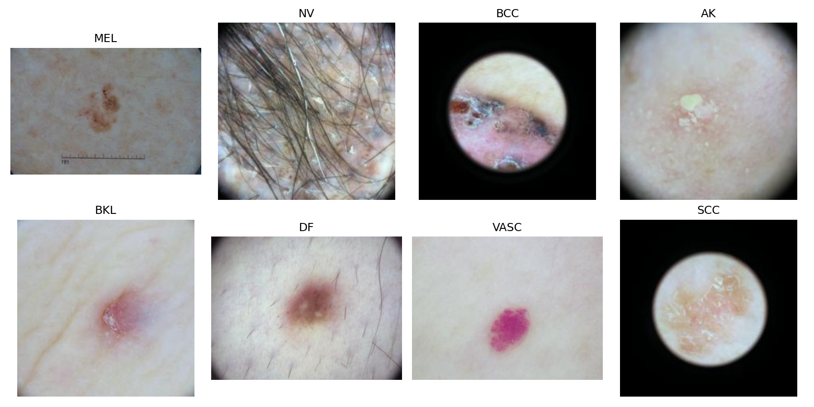
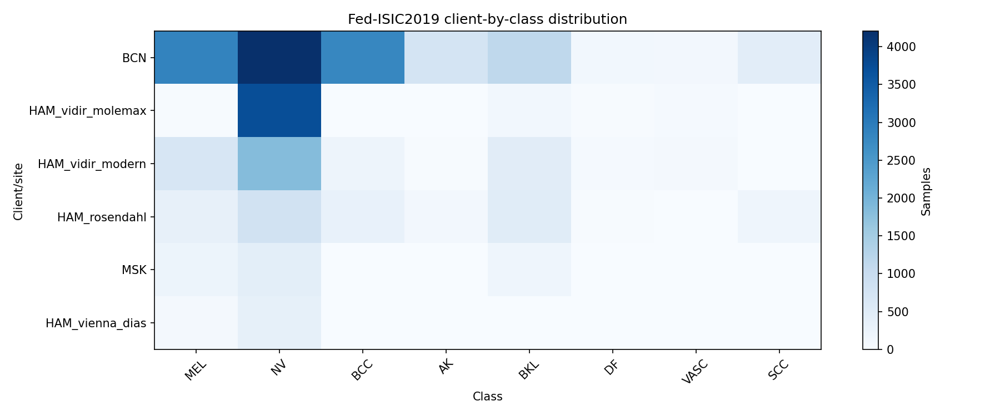
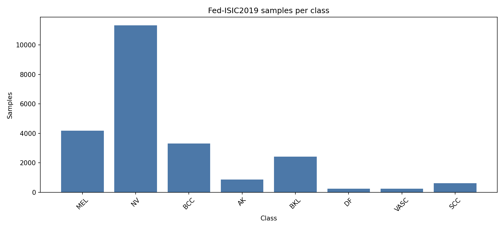
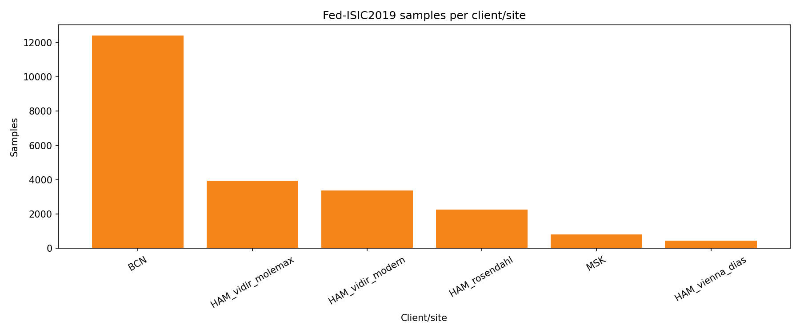
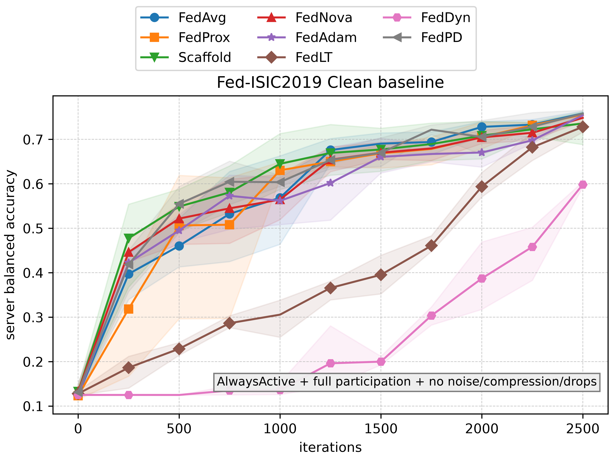
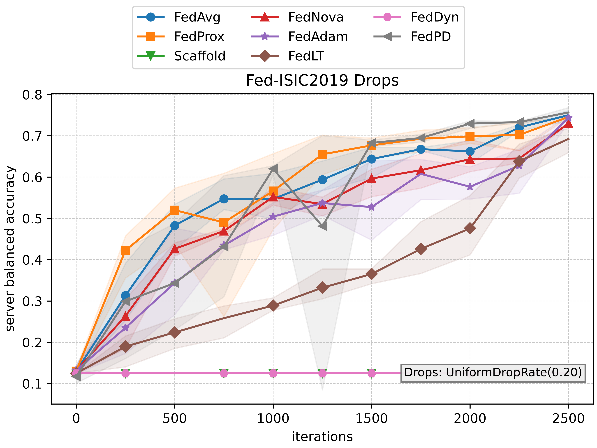
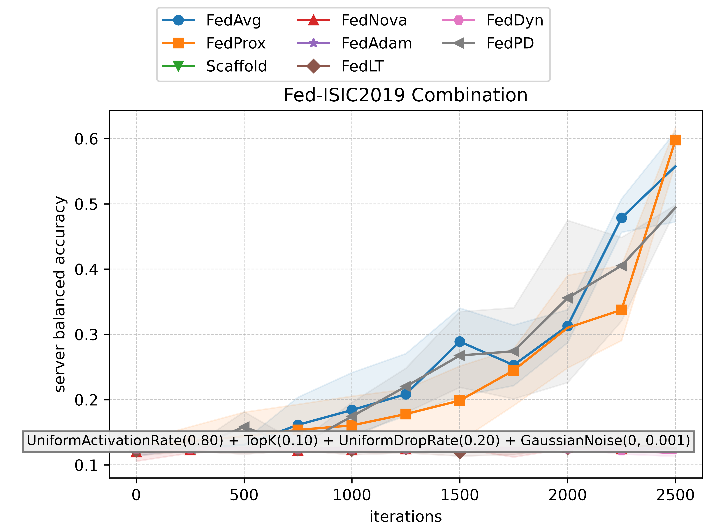

# Fed-ISIC2019 Experiment Setup

This folder contains the thesis-specific Fed-ISIC2019 dataset integration, inspection figures, hyperparameter tuning,
and communication-robustness experiments for `decent-bench`.

## Task and Dataset

Fed-ISIC2019 is a cross-silo federated dataset for **8-class dermoscopic skin-lesion classification**. It contains
23,247 images partitioned across six real acquisition centers, with an official split of 18,597 training images and
4,650 test images. This repository loads the Flower/Hugging Face distribution
[`flwrlabs/fed-isic2019`](https://huggingface.co/datasets/flwrlabs/fed-isic2019), which follows the FLamby
Fed-ISIC2019 benchmark organization [1].

The eight classes are:

| Label | Meaning |
| --- | --- |
| `MEL` | Melanoma |
| `NV` | Melanocytic nevus |
| `BCC` | Basal cell carcinoma |
| `AK` | Actinic keratosis / Bowen's disease-type intraepithelial carcinoma |
| `BKL` | Benign keratosis-like lesion |
| `DF` | Dermatofibroma |
| `VASC` | Vascular lesion |
| `SCC` | Squamous cell carcinoma |

The images originate from BCN_20000, HAM10000, and ISIC challenge sources [2, 3]. The dataset is distributed under the
source data terms, including CC-BY-NC 4.0 as reported by FLamby. The image data is downloaded and cached locally; it is
not included in this repository.

The six client/site IDs follow the FLamby center order. The source provenance below is derived from the FLamby Fed-ISIC2019 README and the HAM10000/ISIC source descriptions.

| Center ID | Center key | Samples | Provenance |
| --- | --- | ---: | --- |
| 0 | `BCN` | 12,413 | BCN_20000 Dataset: Department of Dermatology, Hospital Clinic de Barcelona. |
| 1 | `HAM_vidir_molemax` | 3,954 | HAM10000 Dataset subset from the ViDIR Group, Department of Dermatology, Medical University of Vienna; MoleMax acquisition source. |
| 2 | `HAM_vidir_modern` | 3,363 | HAM10000 Dataset subset from the ViDIR Group, Department of Dermatology, Medical University of Vienna; modern dermatoscopy acquisition source. |
| 3 | `HAM_rosendahl` | 2,259 | HAM10000 Dataset subset associated with Cliff Rosendahl's skin cancer practice source used in HAM10000. |
| 4 | `MSK` | 819 | MSK Dataset, used through the ISIC challenge sources and cited by FLamby as `(c) Anonymous`. |
| 5 | `HAM_vienna_dias` | 439 | HAM10000 Dataset subset from the ViDIR Group, Department of Dermatology, Medical University of Vienna; Vienna DIAS acquisition source. |

### Dataset Inspection

| Example images | Client-by-class distribution |
| --- | --- |
|  |  |

| Samples per class | Samples per client |
| --- | --- |
|  |  |

### Non-IID Characterization

Fed-ISIC2019 is strongly non-IID:

- **Quantity skew:** the official training split ranges from 9,930 images at `BCN` to 351 at
  `HAM_vienna_dias`, a largest-to-smallest ratio of approximately **28.3x**.
- **Label-distribution skew:** lesion proportions differ substantially by center. Some centers are dominated by `NV`,
  while some classes are absent or nearly absent from particular centers.
- **Global class imbalance:** the training split contains 9,084 `NV` images but only 184 `DF` images, approximately
  **49.4x** more majority-class than minority-class samples.
- **Feature/site skew:** hospitals, acquisition devices, protocols, and patient populations may produce center-specific
  covariate shift.

These properties make accuracy alone insufficient and motivate weighted focal loss, balanced accuracy, and explicit
communication-robustness experiments.

## Dataset Handler

`src/fedisic_handler.py` defines `FedISICDatasetHandler`. It:

- loads the official Hugging Face `train` or `test` split;
- detects and validates the center and label metadata;
- returns one lazy `FedISICPartition` per selected center through `get_partitions()`;
- preserves the natural six-center cross-silo partition;
- applies the appropriate train or test transform when an image is accessed;
- returns images as normalized `torch.float32` tensors in `C x H x W` layout;
- returns integer class labels as `torch.long`;
- optionally creates deterministic stratified reduced subsets for pilot experiments.

Example:

```python
from experiments.fedisic2019.src import FedISICDatasetHandler

train_handler = FedISICDatasetHandler(split="train")
test_handler = FedISICDatasetHandler(split="test")

client_train_partitions = train_handler.get_partitions()
client_test_partitions = test_handler.get_partitions()
```

The official train and test splits are used directly. Unlike the FEMNIST setup, Fed-ISIC2019 does not require a
repository-defined train/test split.

## Model

The main model is an ImageNet-pretrained **EfficientNet-B0** [4], implemented with
`torchvision.models.efficientnet_b0`. Its final classification layer is replaced with an eight-logit linear layer:

```text
Input: 3 x 200 x 200
Backbone: ImageNet-pretrained EfficientNet-B0
Classifier: Linear(in_features, 8)
Output: 8 class logits
```

EfficientNet-B0 follows the FLamby Fed-ISIC2019 baseline model family while remaining considerably smaller than later
EfficientNet variants. `FedISICSmallCNN` exists only for smoke tests and is not used for the reported benchmark results.

## Preprocessing and Augmentation

The Hugging Face dataset card instructs users to apply the FLamby-style Albumentations recipe. Albumentations [5]
provides stochastic image augmentation during training and deterministic preprocessing during evaluation.

Training images receive:

- `RandomScale(0.07)`;
- rotation up to 50 degrees;
- random brightness and contrast adjustment;
- random flipping;
- a small affine shear;
- a random `200 x 200` crop;
- one to eight `16 x 16` coarse-dropout regions;
- ImageNet-style normalization;
- conversion from `H x W x C` to `C x H x W` and `float32`.

Test and validation images receive:

- a deterministic center `200 x 200` crop;
- the same normalization;
- conversion to `C x H x W` and `float32`.

The inspected Hugging Face images are not all square, but their shorter edge is 224 pixels, so a `200 x 200` crop is
valid. The handler does not independently apply color constancy. The packaged source is treated as derived from the
FLamby preprocessing pipeline, but color constancy was not independently verified from the Hugging Face generation
metadata.

## Weighted Focal Loss

The experiments use weighted focal loss with `gamma=2.0`, following the FLamby Fed-ISIC2019 baseline and the focal-loss
principle introduced by Lin et al. [6]:

```text
FL = - alpha_y * (1 - p_y)^gamma * log(p_y)
```

Here, `p_y` is the predicted probability of the correct class and `alpha_y` is its class weight. The two components
address different aspects of imbalance:

- **class weighting** gives rare lesion classes more influence;
- **focal modulation** reduces the contribution of easy, high-confidence examples and focuses learning on harder
  examples.

The default FLamby class weights are:

```text
[5.5813, 2.0472, 7.0204, 26.1194, 9.5369, 101.0707, 92.5224, 38.3443]
```

They correspond to the class order `MEL`, `NV`, `BCC`, `AK`, `BKL`, `DF`, `VASC`, and `SCC`.

## Balanced Accuracy

Balanced accuracy is the principal evaluation and hyperparameter-selection metric:

```text
balanced accuracy = (1 / C) * sum(recall_c)
```

It is the unweighted average of recall over all `C` classes [7]. Each lesion class therefore contributes equally,
regardless of its sample count. This is more informative than ordinary accuracy for Fed-ISIC2019 because a model cannot
obtain a strong balanced-accuracy score by primarily predicting the dominant `NV` class. With eight classes, chance
balanced accuracy is `1/8 = 12.5%`.

`decent-bench` provides both client-level `BalancedAccuracy` and server-level `ServerBalancedAccuracy`; the latter is
the primary reference metric in the reported experiments.

## Hyperparameter Tuning

Hyperparameters were selected independently for each algorithm under clean communication using the tuning portion of
the official training split. The primary selection metric was validation server balanced accuracy, with validation loss
used as a tie-breaker. The official test split was not used for hyperparameter selection.

The search followed two stages:

1. **Random coarse search:** reference configurations and randomly sampled candidates explored a compact range of
   learning rates, local epoch counts, and algorithm-specific parameters.
2. **Focused grid search:** a smaller grid was constructed around the strongest coarse candidate to refine its
   continuous parameters and neighboring local epoch counts.

Each candidate used one trial and 1,000 iterations due to the computational cost of full Fed-ISIC2019 training. The
selected candidate was then inspected over a 1,500-iteration validation curve.

The searches also compared algorithm variants where the algorithm name represents a family of methods:

- **FedOpt:** FedAdam, FedYogi, and FedAdagrad were compared. FedAdam was selected.
- **FedNova:** client momentum, server momentum, proximal correction, both momenta, and both momenta with proximal
  correction were compared. Server momentum only was selected.
- **FedLT:** gradient descent, Nesterov, and Adam local solvers were compared. Adam was selected.

Final configurations:

| Algorithm | Selected hyperparameters |
| --- | --- |
| FedAvg | `step_size=0.02`, `num_local_epochs=4` |
| FedProx | `step_size=0.0160131`, `num_local_epochs=4`, `mu=0.00951105` |
| SCAFFOLD | `step_size=0.02`, `num_local_epochs=5`, `server_step_size=0.875` |
| FedNova | `step_size=0.00731339`, `num_local_epochs=3`, server momentum only, `gamma=0.5` |
| FedAdam | `step_size=0.00855447`, `num_local_epochs=4`, `server_step_size=0.00717902`, `beta_1=0.9`, `beta_2=0.9`, `tau=0.001` |
| FedLT | `step_size=0.0008`, `num_local_epochs=3`, `rho=0.05`, Adam solver (`beta1=0.5`, `beta2=0.999`, `epsilon=1e-8`) |
| FedDyn | `step_size=0.0160131`, `num_local_epochs=3`, `alpha=0.330754` |
| FedPD | `step_size=0.03`, `num_local_epochs=5`, `eta=0.3`, `skip_probability=0.2` |

FedDyn remained difficult to tune within the available budget. Its selected candidate improved earlier and reduced loss
more consistently than the low-learning-rate automatic winner, but its validation curve was still unsatisfactory.
FedDyn should therefore be interpreted as an **under-tuned and sensitive baseline**, not as a confidently optimized
configuration.

## Experiment: Communication Robustness

This experiment evaluates all eight tuned algorithms for 2,500 iterations and three trials using the official test
split. There is no client-selection scheme: every active institution participates, which is the normal baseline for a
small cross-silo federation.

The reported conditions are:

| Condition | Activation | Compression | Drops | Noise |
| --- | --- | --- | --- | --- |
| Clean baseline | `AlwaysActive` | `NoCompression` | `NoDrops` | `NoNoise` |
| Drops | `AlwaysActive` | `NoCompression` | `UniformDropRate(0.20)` | `NoNoise` |
| Combined | `UniformActivationRate(0.80)` | `TopK(0.10)` | `UniformDropRate(0.20)` | `GaussianNoise(0.0, 0.001)` |

Cross-silo clients are usually more stable than cross-device clients, but they are not failure-free. Maintenance
windows, institutional outages, network failures, delayed or lost messages, bandwidth constraints, and privacy/security
mechanisms can still introduce temporary unavailability, message drops, compression, or perturbation noise. The clean
condition establishes the algorithmic baseline, the drops condition isolates message loss, and the combined condition
tests a substantially harsher operating environment.

### Results

#### Clean baseline



#### Uniform 20% drops



#### Combined impairments



Under clean communication, FedAvg, FedProx, FedNova, FedAdam, and FedPD form a close leading group at approximately
75-76% server balanced accuracy. A 20% drop rate has little effect on those methods, while SCAFFOLD and FedDyn collapse;
under the combined condition, FedProx performs best at 59.79%, followed by FedAvg at 55.77% and FedPD at 49.41%, while
the remaining methods approach chance level. The large client-drift values observed for the collapsing methods indicate
that the combined impairments destabilize server aggregation rather than merely slowing convergence.

## Folder Structure

- `inspect_fedisic2019.py`: generates dataset statistics and inspection figures.
- `src/fedisic_handler.py`: center-partitioned lazy dataset handler.
- `src/transforms.py`: Albumentations train/test preprocessing.
- `src/model.py`: EfficientNet-B0 benchmark model and smoke-test CNN.
- `src/loss.py`: weighted focal loss and FLamby class weights.
- `experiment0/`: hyperparameter tuning and diagnostic scripts.
- `experiment2/`: uniform versus data-size weighted aggregation.
- `experiment5/`: communication-robustness experiments.
- `selected_hyperparameters.json`: finalized configurations used by later experiments.
- `experiments_log.md`: detailed assumptions, commands, tuning history, and numerical results.
- `figures/`: full-dataset and reduced-pilot inspection outputs.
- `checkpoints/`: retained lightweight metric tables and plots; large checkpoint payloads are not committed.
- `data/`: local Hugging Face cache, ignored by Git.

## References

BibTeX entries are stored in `references.bib`.

1. Ogier du Terrail et al. (2022), *FLamby: Datasets and Benchmarks for Cross-Silo Federated Learning in Realistic Healthcare Settings*.
2. Tschandl, Rosendahl, and Kittler (2018), *The HAM10000 Dataset*.
3. Combalia et al. (2019), *BCN20000: Dermoscopic Lesions in the Wild*.
4. Tan and Le (2019), *EfficientNet: Rethinking Model Scaling for Convolutional Neural Networks*.
5. Buslaev et al. (2020), *Albumentations: Fast and Flexible Image Augmentations*.
6. Lin et al. (2017), *Focal Loss for Dense Object Detection*.
7. Brodersen et al. (2010), *The Balanced Accuracy and Its Posterior Distribution*.

Additional source links:

- FLamby Fed-ISIC2019: https://github.com/owkin/FLamby/tree/main/flamby/datasets/fed_isic2019
- Flower/Hugging Face dataset: https://huggingface.co/datasets/flwrlabs/fed-isic2019
- ISIC 2019 challenge: https://challenge.isic-archive.com/landing/2019/
