# FEMNIST Experiment Setup

This folder contains the thesis-specific FEMNIST setup and inspection utilities.

## Folder Structure

- `inspect_femnist.py`: command-line inspection script.
- `smoke/`: smoke and feasibility scripts for local/Lambda test runs.
- `experiment0/`: hyperparameter tuning scripts and selected Experiment 0 hyperparameter summary.
- `experiment1/`: Experiment 1 baseline benchmark scripts.
- `src/inspection_helpers.py`: inspection/statistics helpers.
- `src/femnist_handler.py`: `FEMNISTDatasetHandler`, used to create decent-bench train/test datasets.
- `src/model.py`: FEMNIST CNN used by the experiment scripts.
- `experiment_log.md`: notes and decisions for the thesis chapter.
- `data/`: local dataset cache, ignored by git.
- `results/`: generated summaries, plots, and future experiment outputs, ignored by git.
- `checkpoints/`: benchmark checkpoints and saved metric outputs, ignored by git.

## Source Decision

FEMNIST originally comes from LEAF [Caldas et al., 2018]. LEAF preprocessing produces JSON files that are already
partitioned by user/writer, with each user containing `x` image vectors and `y` labels. This is the most faithful source
if the LEAF preprocessing pipeline has already been run.

The Hugging Face copy `flwrlabs/femnist`, distributed by Flower Labs, is often more convenient [Beutel et al., 2020]. It
keeps the important fields needed for the benchmark:

- `writer_id`, which gives the natural federated client partition.
- `character`, the 62-class label.
- 28 x 28 images.

The Hugging Face copy has one split, so this experiment code creates a deterministic per-writer train/test split. That is
similar in spirit to LEAF's sample-level train/test split.

## Dataset Overview

FEMNIST contains 28 x 28 grayscale images from 62 classes: 10 digits, 26 uppercase letters, and 26 lowercase letters.
Each sample is associated with its writer, which provides the natural client partition used by the federated benchmark.

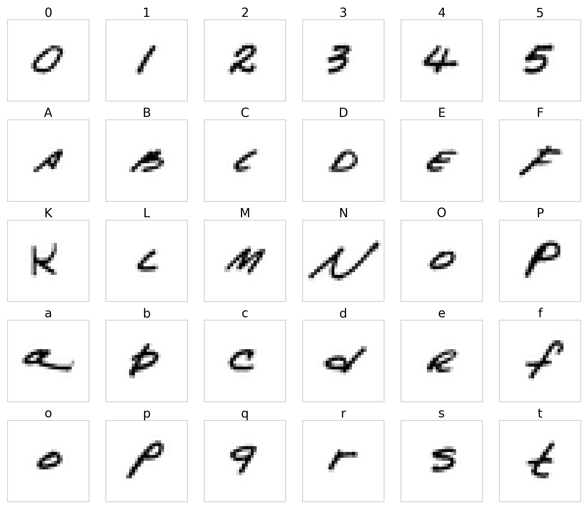

The dataset is imbalanced both across classes and across writers. Digits occur substantially more often than many letter
classes, while the number of samples contributed by each writer also varies considerably.

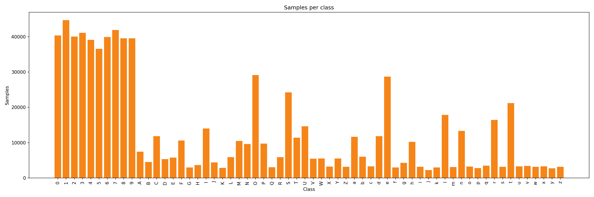

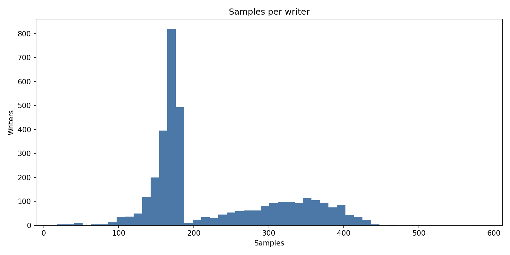

## First Inspection Command

The Hugging Face source requires the optional `datasets` package:

```powershell
.venv\Scripts\python.exe -m pip install datasets
```

Then run:

```powershell
.venv\Scripts\python.exe experiments\femnist\inspect_femnist.py `
  --source huggingface `
  --candidate-clients 100 `
  --seed 20260524
```

The command writes CSV/JSON summaries and plots to `experiments/femnist/results/inspection/`.
The most important files are `all_clients_stats.csv` and `selected_clients_stats.csv`.
After the first download, add `--local-files-only` to use the cached dataset without contacting Hugging Face.
The default selected-client thresholds are `100` train samples and `20` test samples.

If LEAF JSON files have already been generated, use:

```powershell
.venv\Scripts\python.exe experiments\femnist\inspect_femnist.py `
  --source leaf-json `
  --leaf-train-dir path\to\leaf\data\femnist\data\train `
  --leaf-test-dir path\to\leaf\data\femnist\data\test `
  --candidate-clients 100 `
  --seed 20260524
```

## Using the Dataset Handler

```python
from experiments.femnist.src import FEMNISTDatasetHandler

train_dataset = FEMNISTDatasetHandler(split="train")
test_dataset = FEMNISTDatasetHandler(split="test")

train_partitions = train_dataset.get_partitions()
test_data = test_dataset.get_datapoints()
```

By default, the handler downloads/cache-loads `flwrlabs/femnist` and deterministically selects the clients using
`n_clients`, `min_train_samples`, `min_test_samples`, and `seed`. This means the same code can run on a remote GPU from a
clean clone without uploading the cached dataset or the inspection CSV files.

For a CNN, the default image layout is `(1, 28, 28)`. For an MLP, use `image_layout="flat"` to get vectors of shape
`(784,)`.

If the dataset is already cached and the machine should not contact Hugging Face, pass `local_files_only=True`. If a
fixed selected-client manifest should be used instead of deterministic reselection, pass `selected_clients_path`.

## Keeping the Same Clients Across Experiments

If two runs use the same FEMNIST handler settings, they select the same clients:

- `n_clients`
- `min_train_samples`
- `min_test_samples`
- `seed`
- `train_fraction`

The default values select the same 100 writers every time.
Dataset splitting and client selection use the decent-bench interoperability RNG layer.

For extra safety, or when the selected clients should be fixed explicitly from a saved file, pass the selected-client
manifest:

```python
FEMNISTDatasetHandler(
    split="train",
    selected_clients_path="experiments/femnist/results/inspection/selected_clients_stats.csv",
)
```

Use the same `selected_clients_path` for both train and test handlers.

## FEMNIST Benchmark Setup

All FEMNIST experiments should use the same selected writer set. The selected set is defined by:

- `n_clients = 100`
- `seed = 20260524`
- `train_fraction = 0.8`
- `min_train_samples = 100`
- `min_test_samples = 20`
- `clients_per_round = 20` / `selection_fraction = 0.2`
- `n_trials = 3`
- `iterations = 1500`
- `state_snapshot_period = 150`
- `checkpoint_step = None`
- `batch_size = 32`

These settings deterministically select the 100 writers that will be used throughout the FEMNIST benchmark experiments.
Do not change the seed or selection thresholds between experiments, otherwise the runs will no longer be directly
comparable.

The heatmap below shows the class counts for the selected writers. Rows correspond to writers and columns to the 62
classes. It illustrates the label-distribution heterogeneity retained by the seeded 100-writer subset.

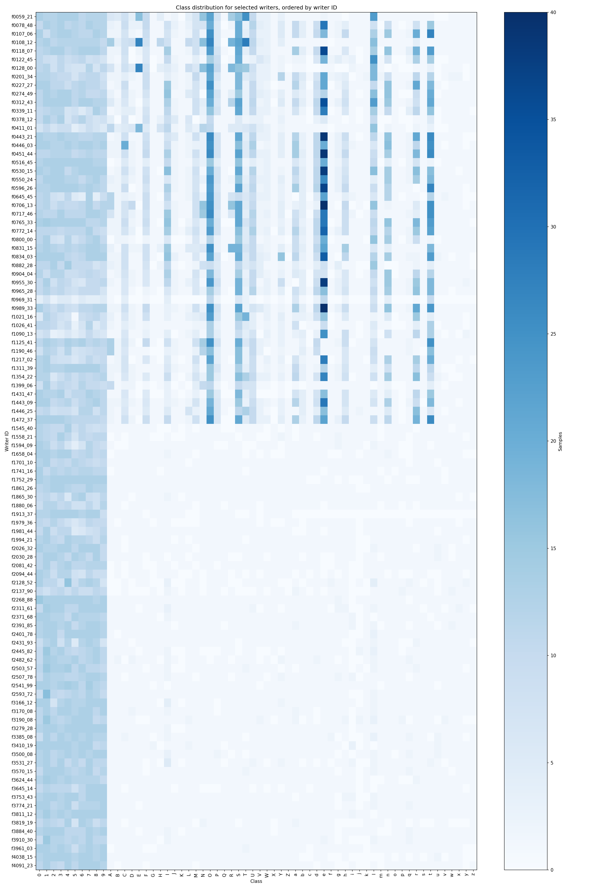

The CNN model selected for all FEMNIST experiments is:

```text
Input: 1 x 28 x 28
Conv2d: 1 -> 32, kernel 5x5, padding 2, ReLU
MaxPool2d: 2x2
Conv2d: 32 -> 64, kernel 5x5, padding 2, ReLU
MaxPool2d: 2x2
Flatten: 64 * 7 * 7
Dense: 256, ReLU
Output Dense: 62 logits
Loss: torch.nn.CrossEntropyLoss
```

The model outputs logits, not softmax probabilities. `torch.nn.CrossEntropyLoss` applies the softmax/log-softmax
operation internally.

## Hyperparameter Tuning and Selection

Experiment 0 used a fixed hold-out split of the handler's training data: 80% for candidate training and 20% for
validation. The test split was reserved for the later benchmark experiments. Candidate selection primarily used
validation/server accuracy, with validation loss as a tie-breaker.

The tuning process used one trial per candidate to control runtime and memory, a client selection fraction of `0.2`, and
separate processes for each algorithm family. A random or coarse search was followed by a focused grid around the best
candidate. FedOpt variants, FedNova mechanisms, and FedLT local solvers were explicitly compared. FedPD was tuned with
full participation because its implementation does not support partial client participation. Final candidates
were also inspected with longer learning curves; SCAFFOLD was retuned over three trials after its initial one-trial
selection showed poor stability.

The accepted hyperparameters are:

| Algorithm | Selected variant | Hyperparameters |
| --- | --- | --- |
| FedAvg | FedAvg | `step_size=0.1`, `num_local_epochs=4` |
| FedProx | FedProx | `step_size=0.1`, `num_local_epochs=4`, `mu=0.025887619090591573` |
| SCAFFOLD | Stable three-trial candidate | `step_size=0.02`, `num_local_epochs=5`, `server_step_size=1.0` |
| FedNova | Local and server momentum, no proximal term | `step_size=0.015780201353739066`, `num_local_epochs=3`, `use_momentum=true`, `use_server_momentum=true`, `use_prox=false`, `beta=0.5`, `gamma=0.9` |
| FedAdam | Selected from the FedOpt family | `step_size=0.016454811464286817`, `num_local_epochs=7`, `server_step_size=0.005781649782731609`, `beta_1=0.9`, `beta_2=0.9`, `tau=0.001` |
| FedLT | Adam local solver | `step_size=0.0015`, `num_local_epochs=5`, `rho=1.0`, `beta1=0.5`, `beta2=0.999`, `epsilon=1e-8` |
| FedDyn | FedDyn | `step_size=0.02760842017693185`, `num_local_epochs=2`, `alpha=1.0` |
| FedPD | Full participation | `step_size=0.03`, `num_local_epochs=5`, `eta=0.3`, `skip_probability=0.2` |

The machine-readable source of truth is
[`experiment0/selected_hyperparameters.json`](experiment0/selected_hyperparameters.json).

## Experiment: Communication Robustness

Experiment 5 evaluates the selected algorithms under controlled communication impairments. Each impairment family is
tested independently against the clean baseline, followed by a condition in which activation, compression, message
drops, and noise are applied together. The completed conditions with saved server-accuracy results are:

| Condition family | Tested conditions |
| --- | --- |
| Clean | Always-active clients, no compression, no message drops, and no message noise |
| Activations | Uniform activation with `p=0.30` and `p=0.80`; Markov activation with high- and low-availability transition probabilities |
| Drops | Uniform message-drop rates of `0.05` and `0.50` |
| Noises | Zero-mean Gaussian message noise with standard deviations `0.001` and `0.01` |
| Compressions | TopK compression retaining `1%` and `10%` of update elements |
| Combined | Uniform activation `p=0.50`, TopK `10%`, message-drop rate `0.10`, and Gaussian noise with standard deviation `0.001` |

### Clean

The clean baseline uses always-active clients with no compression, message drops, or message noise. It provides the
reference performance used to assess degradation under every impaired condition.

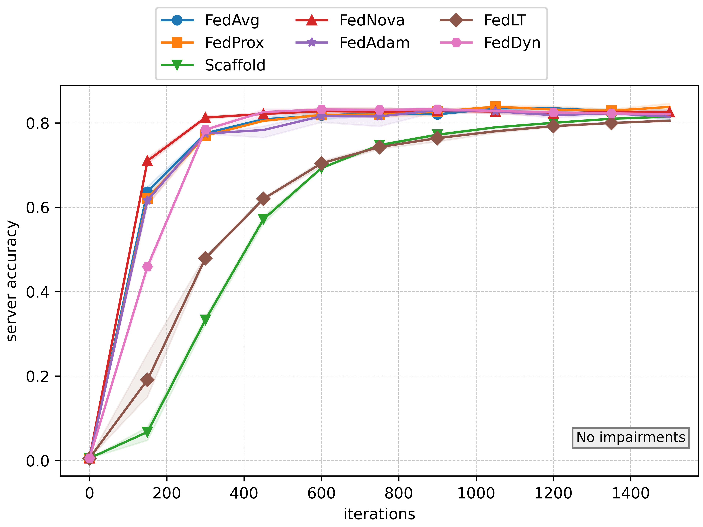

### Activations

- **Uniform activation:** clients are independently available with probability `p=0.30` in the low-availability
  condition and `p=0.80` in the high-availability condition.
- **Markov activation:** the high-availability condition uses inactive-to-active and active-to-inactive transition
  probabilities of `0.20` and `0.10`; the low-availability condition uses `0.10` and `0.30`.

<table>
  <tr>
    <td>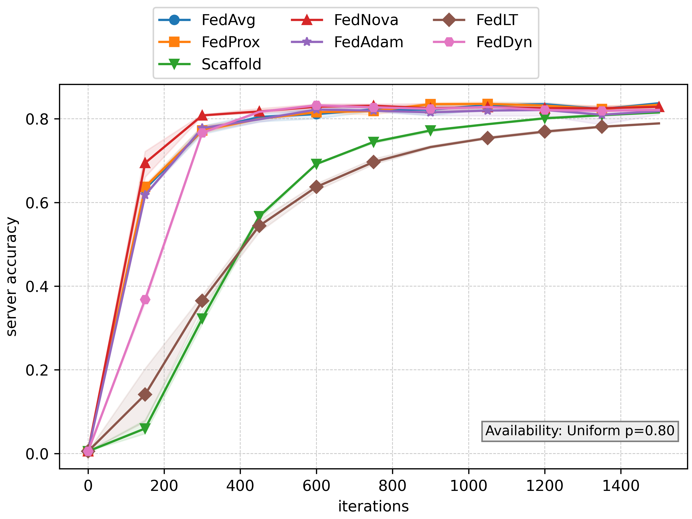<br><sub>Uniform activation, p=0.80</sub></td>
    <td>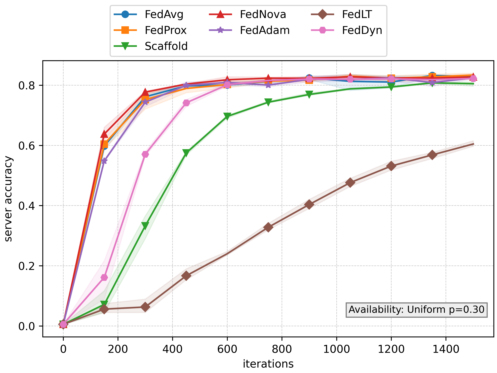<br><sub>Uniform activation, p=0.30</sub></td>
  </tr>
  <tr>
    <td>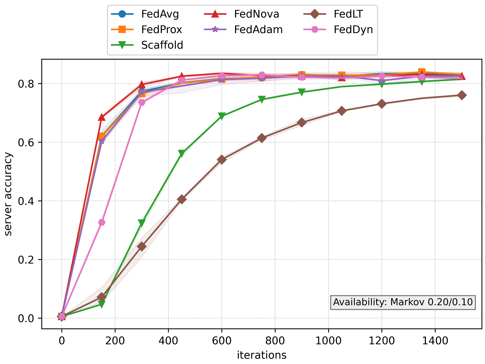<br><sub>Markov activation, high availability</sub></td>
    <td>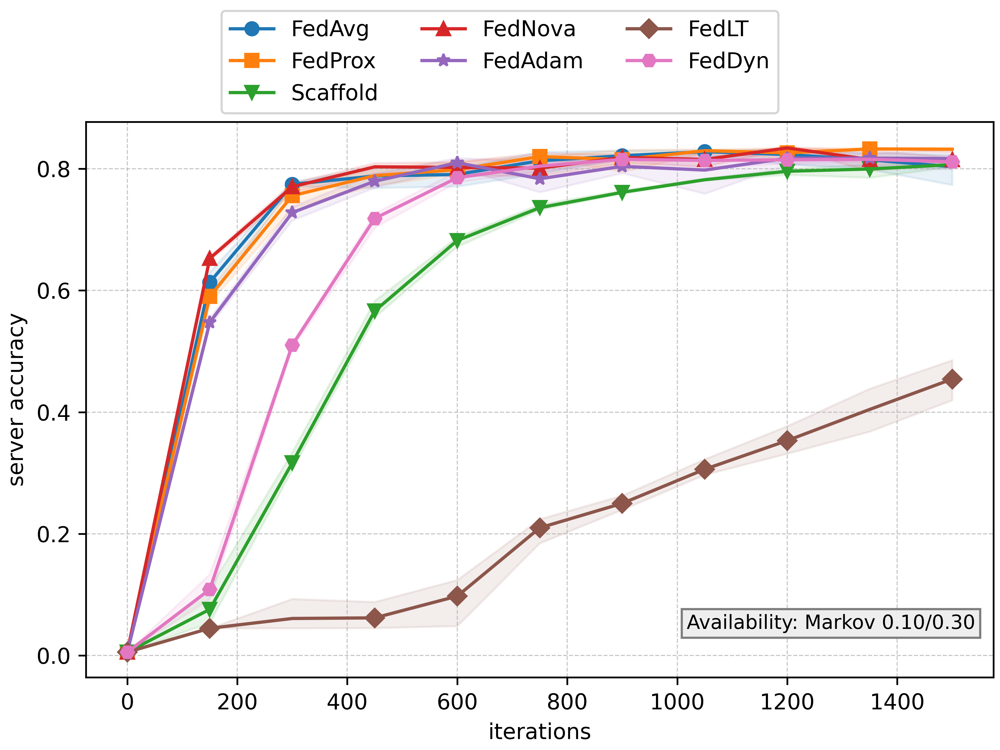<br><sub>Markov activation, low availability</sub></td>
  </tr>
</table>

### Drops

- **Low drop rate:** each message is dropped independently with probability `0.05`.
- **High drop rate:** each message is dropped independently with probability `0.50`.

<table>
  <tr>
    <td>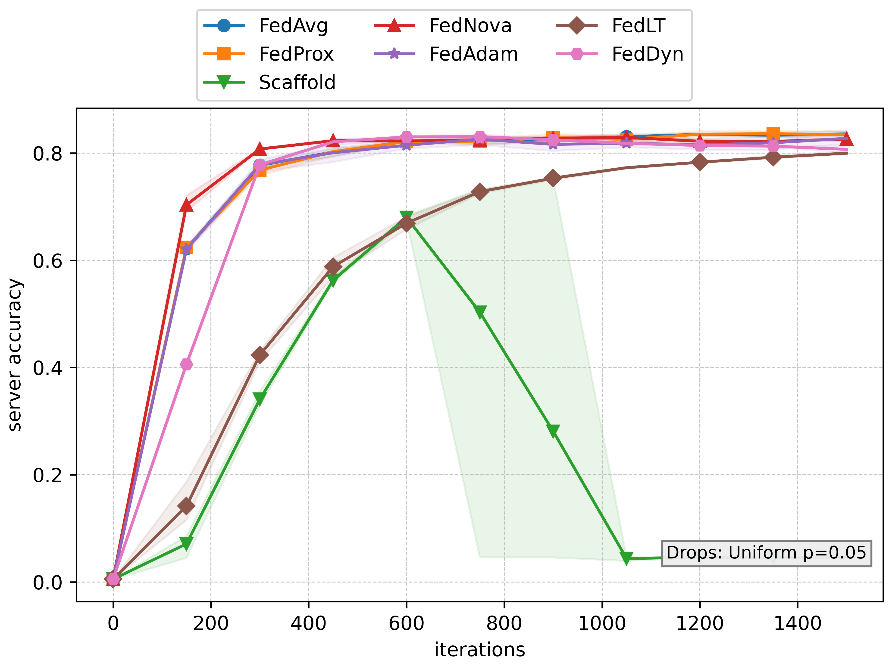<br><sub>Uniform drops, p=0.05</sub></td>
    <td>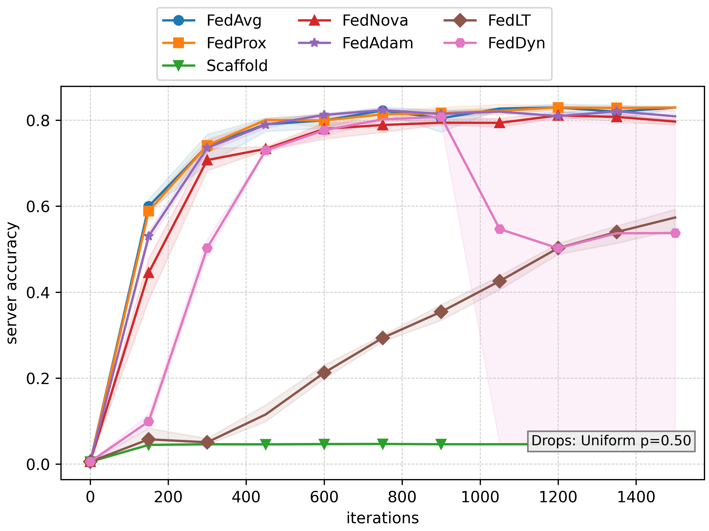<br><sub>Uniform drops, p=0.50</sub></td>
  </tr>
</table>

### Noises

- **Low noise:** zero-mean Gaussian noise with standard deviation `0.001` is added to communicated messages.
- **High noise:** zero-mean Gaussian noise with standard deviation `0.01` is added to communicated messages.

<table>
  <tr>
    <td>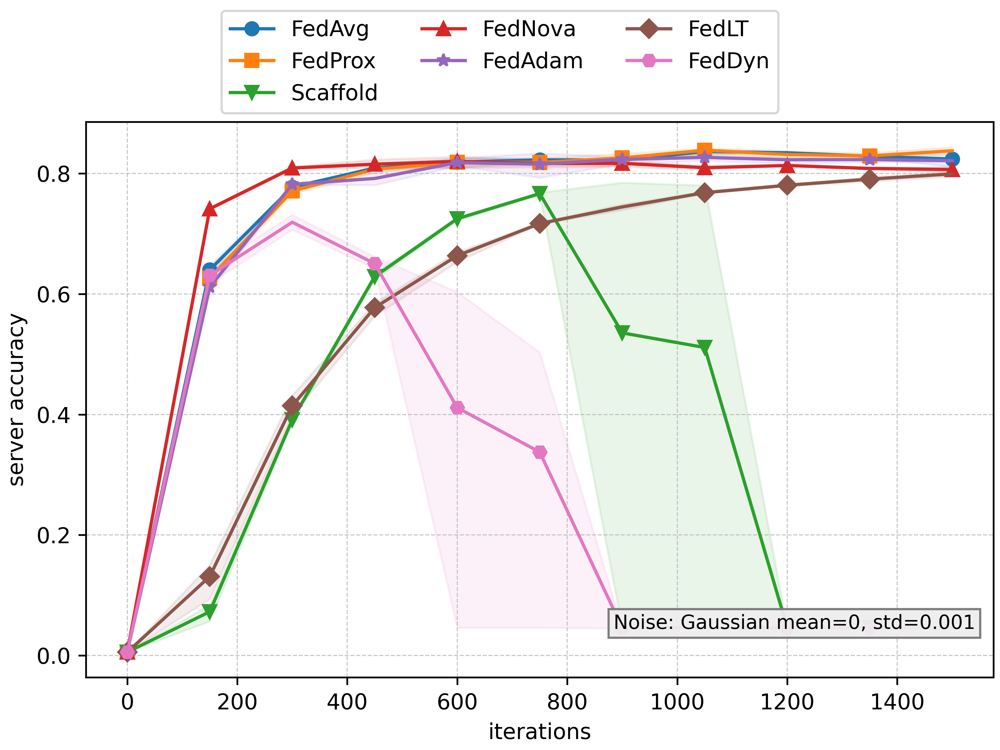<br><sub>Gaussian noise, std=0.001</sub></td>
    <td>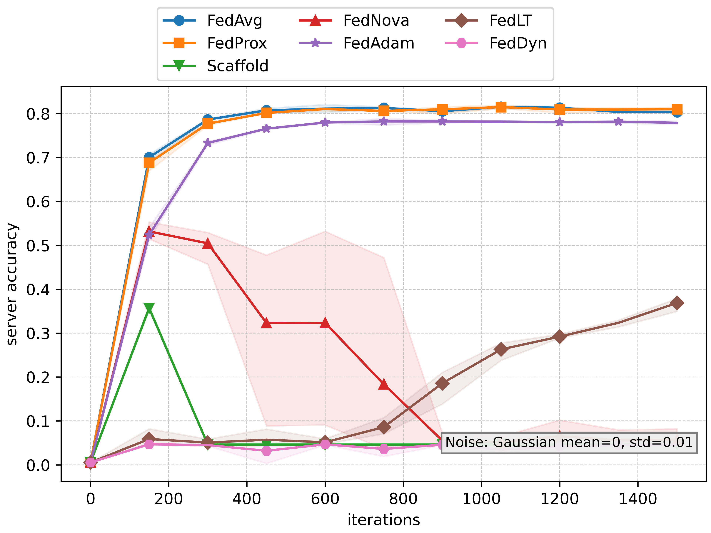<br><sub>Gaussian noise, std=0.01</sub></td>
  </tr>
</table>

### Compressions

- **TopK 1%:** only the largest `1%` of update elements by magnitude are retained.
- **TopK 10%:** the largest `10%` of update elements by magnitude are retained.

<table>
  <tr>
    <td>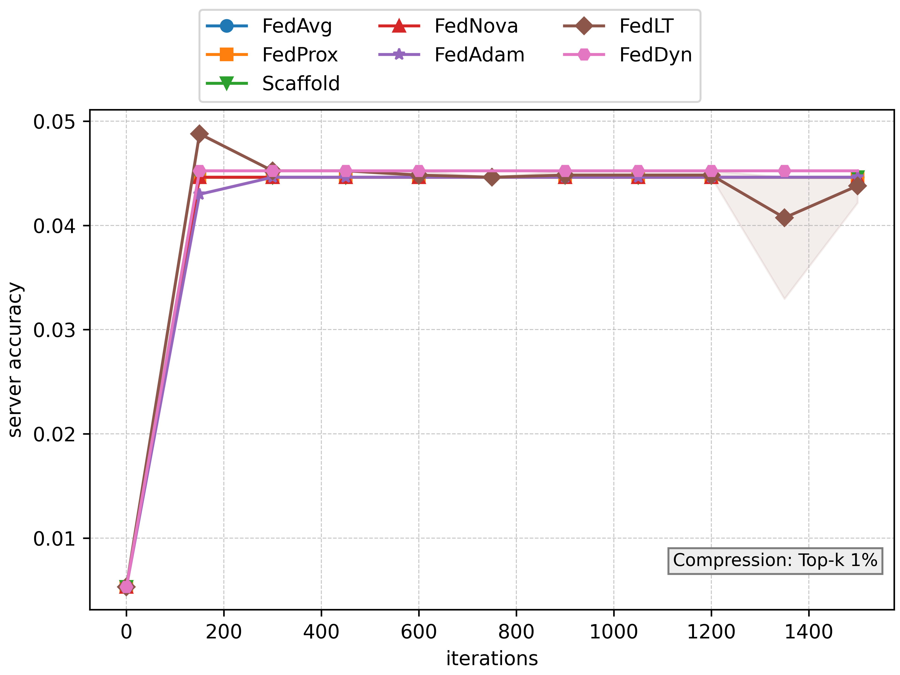<br><sub>TopK, k=1%</sub></td>
    <td>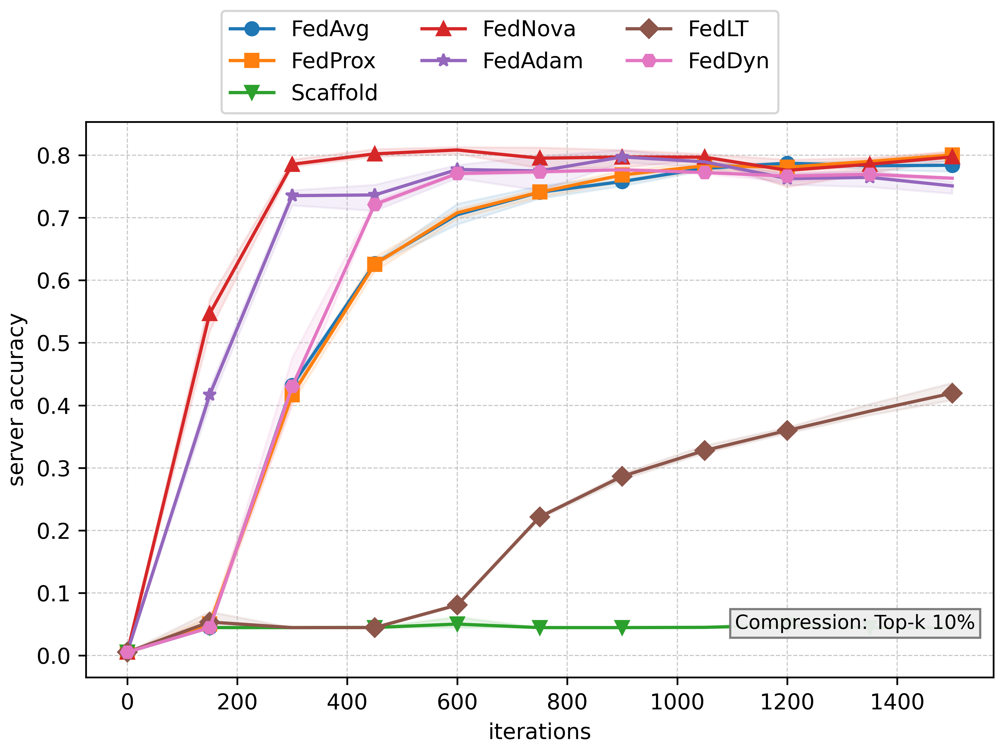<br><sub>TopK, k=10%</sub></td>
  </tr>
</table>

### Combined

The combined condition applies uniform client activation with `p=0.50`, TopK compression retaining `10%` of update
elements, a uniform message-drop rate of `0.10`, and zero-mean Gaussian message noise with standard deviation `0.001`.

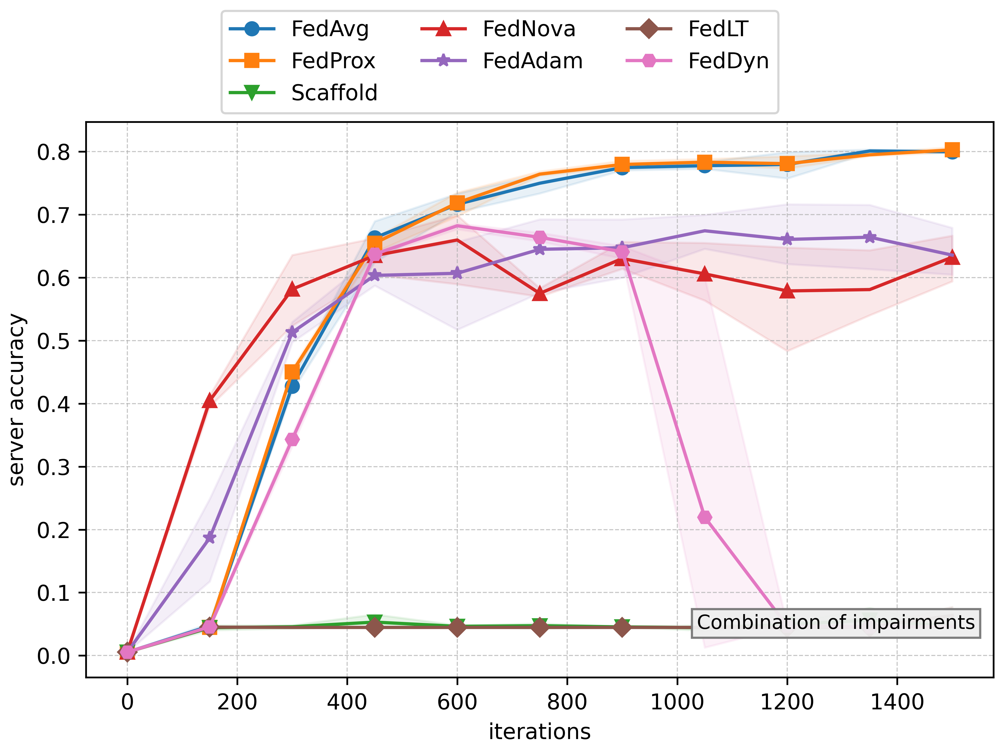

### Results Summary

FedAvg and FedProx were the most robust overall and remained close to their clean baselines even under the combined
condition. Reduced client availability primarily affected FedLT, while compression, message drops, and Gaussian noise
produced stronger algorithm-specific failures, especially for SCAFFOLD and FedDyn. Retaining only `1%` with TopK caused
all algorithms to collapse to near-random accuracy, making aggressive compression the most consistently destructive
single impairment tested.

## References

The BibTeX entries used for this dataset setup are stored in `references.bib`.

- Caldas et al. (2018), LEAF: A Benchmark for Federated Settings.
- Beutel et al. (2020), Flower: A Friendly Federated Learning Research Framework.
